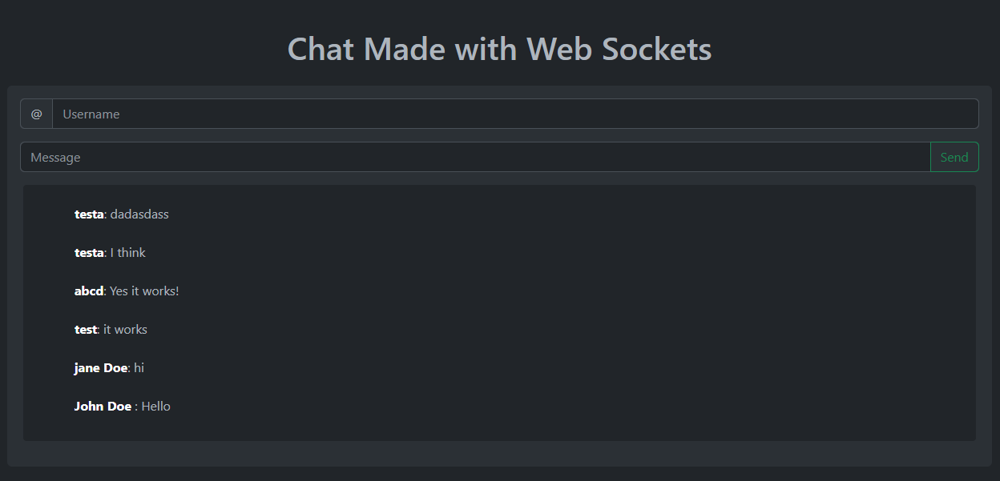

<h3 align="center">Chat WebSocket</h3>

  <a href="" rel="noopener">

 </a>


---

<p align="center"> Chat made with web sockets, express and lowdb
    <br> 
</p>


## About <a name = "about"></a>

I made this project to learn
### Prerequisites

If you want to download install this 

```shell
git
node
```

### Installing

first clone the repository

```shell
git clone 
```

And then install all dependencies

```shell
npm install
```


## Running 

use the command
```shell
npm run start
```

